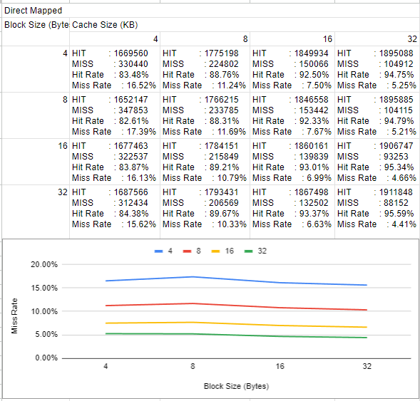
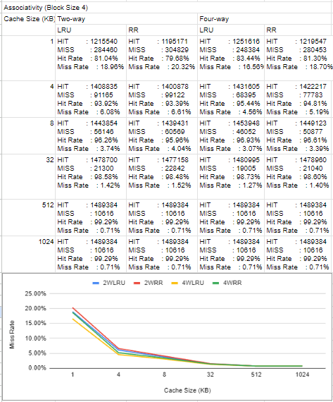

# COMP SYS ARCH: Assignment 2

> Please design an experiment (using the cache simulator) for studying the factors that affects the performance of cache accesses. We will address traces from gcc_ld_trace.txt or go_ld_trace.txt as benchmarks. Please fill your results and plot graph of each table. In particular, what does the results suggest about the design of cache.

## a. Block Size Tradeoff on direct mapped cache.

The experiment shows that as the total cache size increases, the miss rate decreases because the cache can retain a larger portion of the program's working set, thereby minimizing capacity misses.

The results also highlight the impact of spatial locality through block size adjustments. Generally, increasing the block size from 4 bytes to 32 bytes reduces the miss rate because loading one memory address also brings in neighboring data that the processor is likely to need soon.

## b. N-way associative cache with replacement algorithms: Least recently used (LRU), and Round Robin (RR).

The experiment shows that increasing associativity provides a lower miss rate, especially in smaller caches. By allowing a memory block to reside in one of four possible locations rather than just two, the system reduces conflict misses, which occur when multiple memory addresses compete for the same cache set.

Furthermore, LRU consistently yields a lower miss rate. This is because LRU more effectively exploits temporal locality by prioritizing the retention of the most recently accessed data. As the cache size reaches 512 KB and above, the miss rates for all configurations equalize at 0.71%. This demonstrates a point of diminishing returns where increasing cache size, associativity, or policy complexity no longer provides a performance gain.