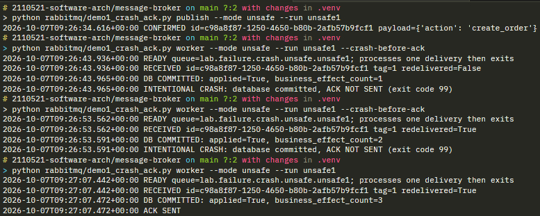
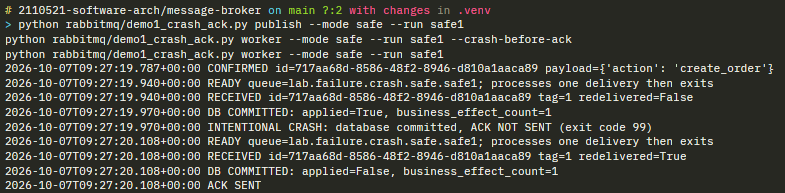

# Message Queue Lab — Submission

## Exercise 1 — RabbitMQ: Crash Before ACK

- [ ] Terminal output from the **unsafe** mode — both the crash run and the restart, showing `applied` and `business_effect_count` 

- [ ] Terminal output from the **safe** mode — both the crash run and the restart, showing `applied` and `business_effect_count` 

- [ ] Written explanation (3–5 sentences): Why does the unsafe mode produce a duplicate? How does the safe mode prevent it, and what role does the single transaction play?

RabbitMQ will try to send the message to consumer until it receives at least 1 ACK. The consumer in this context polls for 1 message from message queue, process and send ACK back. In unsafe mode, the consumer doesn't check whether the table has the requested row or not and always do INSERT. When the unsafe consumer doesn't send ACK back to broker, the broker will repeatedly try to send message, which cause consumer to perform duplicated effects. In safe mode, the consumer checks whether the table has the requested before execution. Therefore, even if the consumer fails to send ACK and receives duplicated request, there is no duplicated effect. 

## Exercise 2 — RabbitMQ: Late Subscribers

- [ ] Terminal output from the **durable** consumer showing both `BEFORE` and `AFTER` received
- [ ] Terminal output from the **temporary** consumer showing `AFTER` received and `BEFORE` missing
- [ ] Written explanation (3–5 sentences): Why did the temporary queue miss `BEFORE`? What would need to change for it to receive `BEFORE`?

## Exercise 3 — RabbitMQ: Delivery vs. Completion Order

- [ ] Terminal output from the **3-worker** run showing completion order
- [ ] Terminal output from the **1-worker** run showing completion order
- [ ] Written explanation (3–5 sentences): Why do the two runs produce different completion orders? When would you choose one worker over three?

---

## Exercise 4 — Kafka: Consumer Groups and Partitions

- [ ] Evidence logs (or terminal screenshots) showing partition assignment for group sizes **2, 4, and 5**
- [ ] Evidence log from the **analytics group** replay showing all 40 records received
- [ ] Written explanation (3–5 sentences): Why is the 5th consumer idle? Why can the analytics group replay all records that the first group already consumed?

## Exercise 5 — Kafka: Keyed Ordering

- [ ] Evidence logs from the **keyed** mode confirming sequence 1→2→3 is preserved for each order
- [ ] Evidence logs from the **broken** mode showing out-of-order completion
- [ ] Written explanation (3–5 sentences): What causes the difference between the two modes? Who is responsible for ensuring business-level ordering — the producer, the broker, or the consumer?

## Exercise 6 — Kafka: Crash Before Offset Commit

- [ ] Terminal output from the **unsafe** mode — crash run and restart, showing `applied` and `business_effect_count`
- [ ] Terminal output from the **safe** mode — crash run and restart, showing `applied` and `business_effect_count`
- [ ] Written explanation (3–5 sentences): Compare the Kafka offset commit mechanism in this exercise with the RabbitMQ ACK mechanism in Exercise 1. What is the same? What is different?

## Overall Submission Checklist

Combine all of the above into **one PDF or Markdown file** and submit before the deadline.

- [ ] Exercise 1 — unsafe and safe terminal output + written explanation
- [ ] Exercise 2 — durable and temporary terminal output + written explanation
- [ ] Exercise 3 — 3-worker and 1-worker terminal output + written explanation
- [ ] Exercise 4 — partition assignment logs (groups of 2, 4, 5) + analytics replay log + written explanation
- [ ] Exercise 5 — keyed and broken evidence logs + written explanation
- [ ] Exercise 6 — unsafe and safe terminal output + written explanation
- [ ] Overall Reflection (5–8 sentences): Which failure mode surprised you most, and why? What design principle would you apply in your own system to handle message redelivery safely?

---

## Concepts Summary

The table below shows which core concepts each exercise covers.

| Concept | Ex 1 | Ex 2 | Ex 3 | Ex 4 | Ex 5 | Ex 6 |
|---|:---:|:---:|:---:|:---:|:---:|:---:|
| At-least-once delivery | ✅ | | | | | ✅ |
| Idempotency / deduplication | ✅ | | | | | ✅ |
| Acknowledgement / offset commit | ✅ | | | | | ✅ |
| Queue durability & binding time | | ✅ | | | | |
| Fanout / pub-sub routing | | ✅ | | | | |
| Work queue / competing consumers | | | ✅ | | | |
| Concurrency & completion order | | | ✅ | | | |
| Consumer groups & partition assignment | | | | ✅ | | |
| Independent group replay | | | | ✅ | | |
| Key-based partitioning & ordering | | | | | ✅ | |
| Cross-partition ordering failure | | | | | ✅ | |
| Producer idempotence | | | | | ✅ | |
| Crash recovery & progress tracking | ✅ | | | | | ✅ |
| RabbitMQ vs Kafka comparison | | | | | | ✅ |
